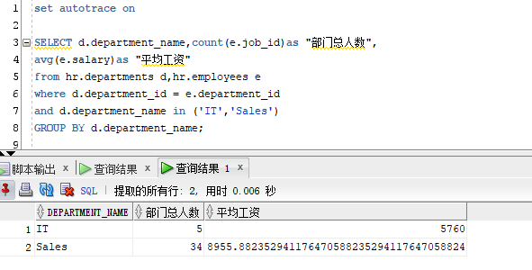
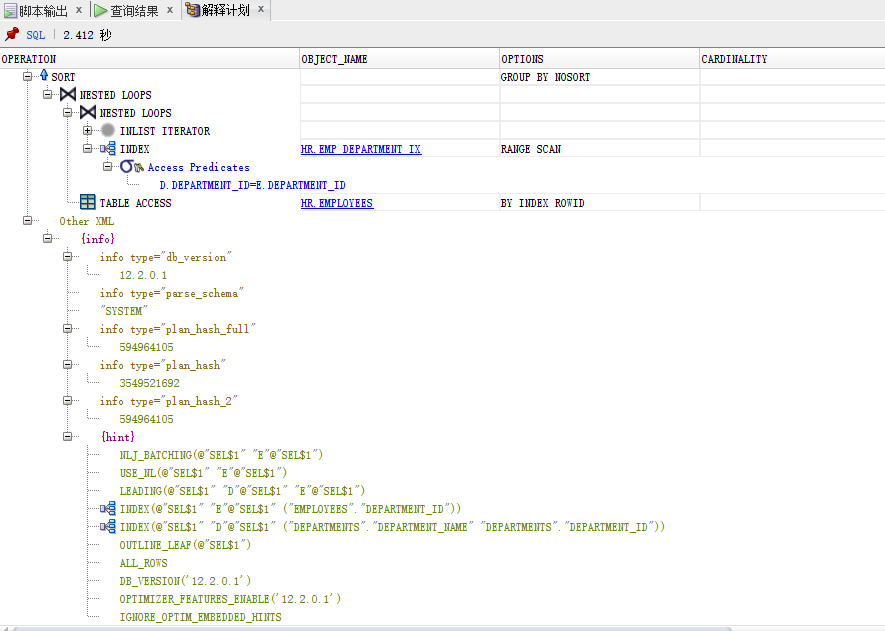
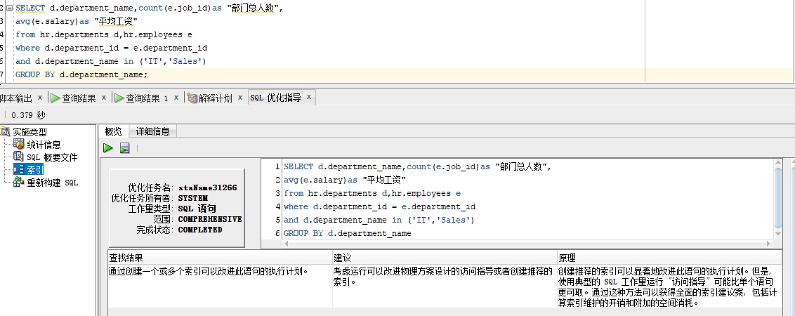
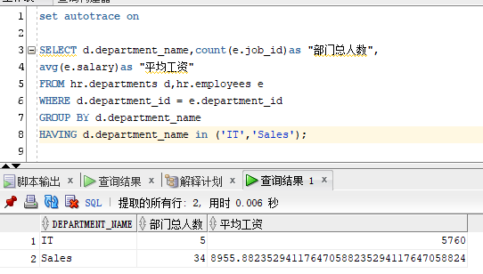
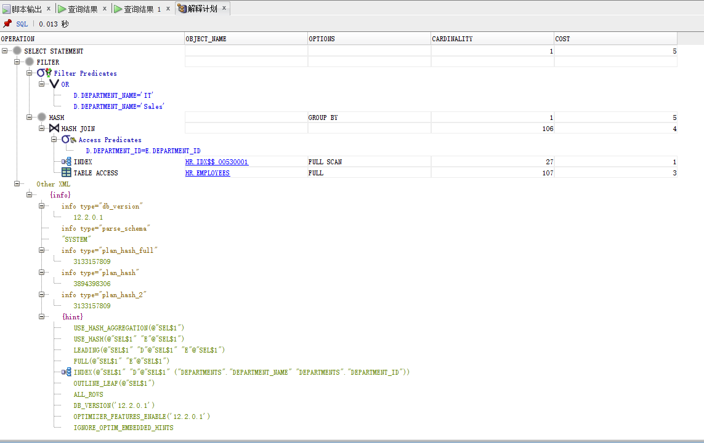
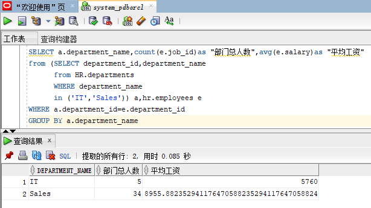
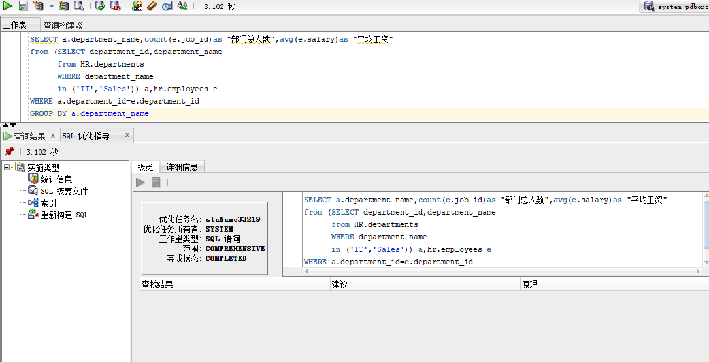

# 实验1：SQL语句的执行计划分析与优化指导

## 刘家银 软件18-3 学号：201810414313

## 实验目的

分析SQL执行计划，执行SQL语句的优化指导。理解分析SQL语句的执行计划的重要作用。

## 实验内容

### 语句1

- sql1：

> ```sql
> set autotrace on
> 
> SELECT d.department_name,count(e.job_id)as "部门总人数",
> avg(e.salary)as "平均工资"
> from hr.departments d,hr.employees e
> where d.department_id = e.department_id
> and d.department_name in ('IT','Sales')
> GROUP BY d.department_name;
> ```

- 查询结果：



- 执行计划：



- sql1优化指导：



> 我们可以看出优化指导工具告诉我们可以通过创建一个或多个索引可以对我们的sql语句改进执行计划。
>

### 语句2

- sql2：

> ```sql
> set autotrace on
> 
> SELECT d.department_name,count(e.job_id)as "部门总人数",
> avg(e.salary)as "平均工资"
> FROM hr.departments d,hr.employees e
> WHERE d.department_id = e.department_id
> GROUP BY d.department_name
> HAVING d.department_name in ('IT','Sales');
> ```

- 查询结果：



- 执行计划：



## 代码改进

> ```sql
> SELECT a.department_name,count(e.job_id)as "部门总人数",avg(e.salary)as "平均工资"
> from (SELECT department_id,department_name 
>       from HR.departments 
>       WHERE department_name in ('IT','Sales')) a,hr.employees e
> WHERE a.department_id=e.department_id
> GROUP BY a.department_name
> ```

- 查询结果



- 优化指导




## 实验总结

- 对两条sql语句进行比较，发现语句1相较于语句2，它的查询处理的数据从理论上来说会少很多，也就是查询1的查询效率比查询2的效率要高。

- 原因是sql1先判断了条件进行筛选再select出结果，然而sql2的语句筛选并不完善，进行了两次筛选，浪费了资源。

- 综上所述，sql查询语句1是最优的。

- 另外对于自己改进的sql代码，在原有的基础上，将department表先按条件查询进行了筛选组成了一个新表a。这样与之前的语句相比，优点在于之后将a表与employees表连接的时候减少了数据的条数，提高查询效率。