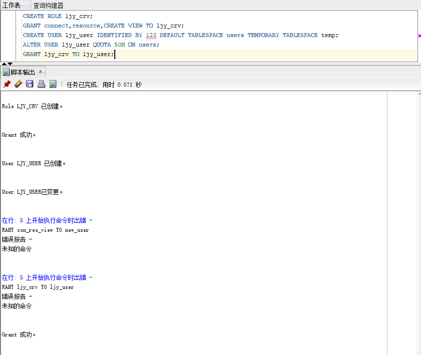
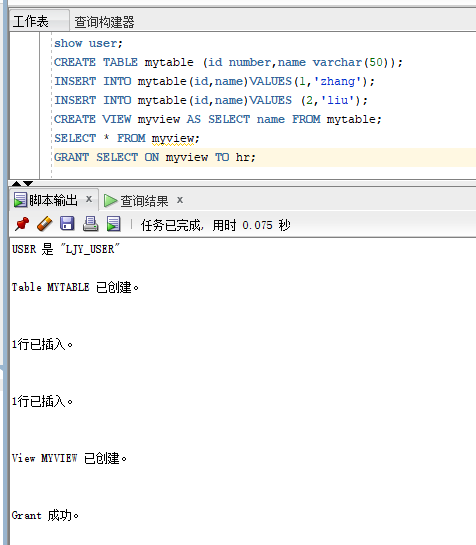
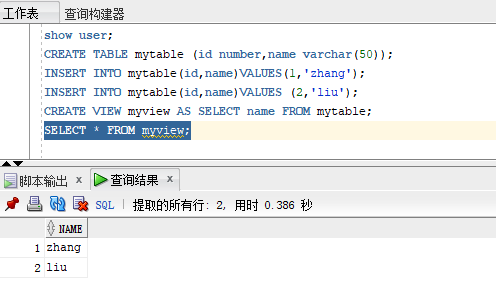
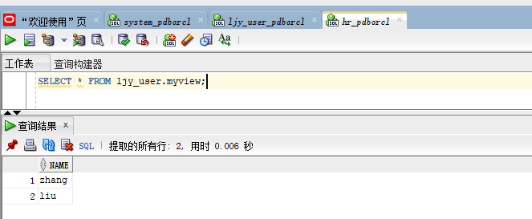
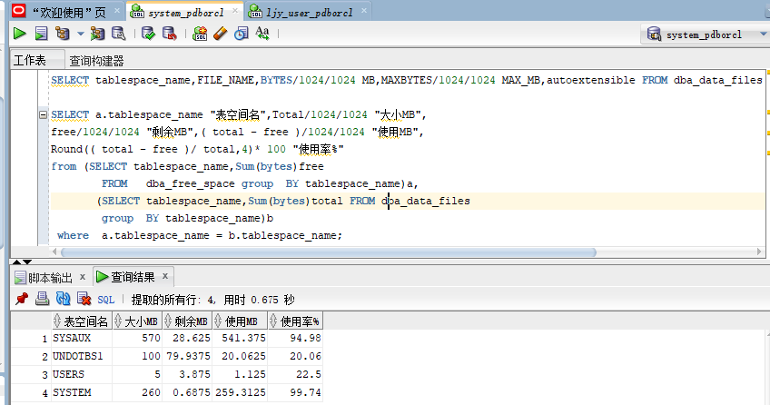

# 实验2：用户及权限管理

## 刘家银 软件18-3 学号：201810414313

> 此次实验创建的用户名是：ljy_user,创建的角色是：ljy_crv

## 实验目的

掌握用户管理、角色管理、权根维护与分配的能力，掌握用户之间共享对象的操作技能。

## 实验内容

- 在pdborcl插接式数据中创建一个新的本地角色con_res_view，该角色包含connect和resource角色，同时也包含CREATE VIEW权限，这样任何拥有con_res_view的用户就同时拥有这三种权限。
- 创建角色之后，再创建用户new_user，给用户分配表空间，设置限额为50M，授予con_res_view角色。
- 最后测试：用新用户new_user连接数据库、创建表，插入数据，创建视图，查询表和视图的数据。

## 实验步骤

- 以system登录到pdborcl，创建角色con_res_view和用户new_user，并授权和分配空间

- 新用户new_user连接到pdborcl，创建表mytable和视图myview，插入数据，最后将myview的SELECT对象权限授予hr用户。

- hr连接到pdborcl，查询new_user授予它的视图myview

- 查看表空间的数据库文件，以及每个文件的磁盘占用情况

## 实验结果分析

- 通过这次实验能够充分感受到Oracle的强大之处以及它的特点。在多用户和大事务量的事务处理的能力上来说是很强的。正如这次实验每个同学创建的不同的用户，但都使用users存储表的数据，表空间中粗出了很多相同名字的mytable和myview，分别属于不同用户不会造成混淆。随着用户往表中插入数据，表空间的磁盘使用量会增加。

- Oracle在保持数据安全性和完整性方面性能优越