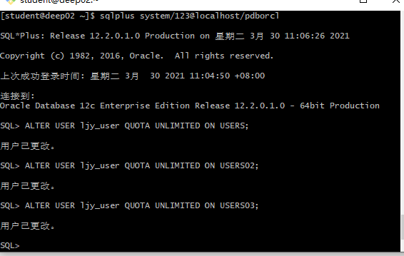
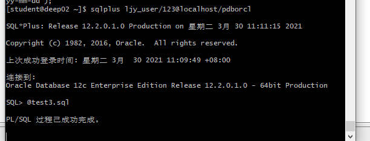
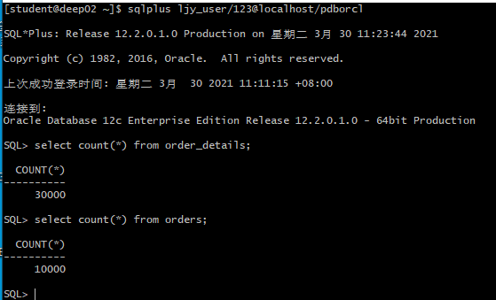
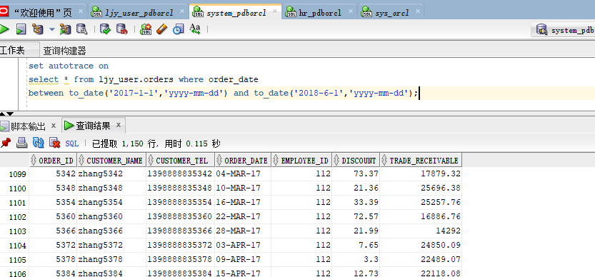
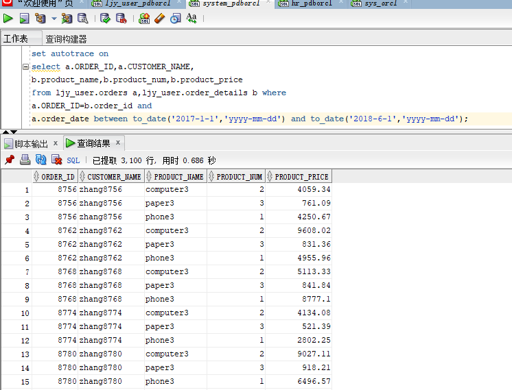
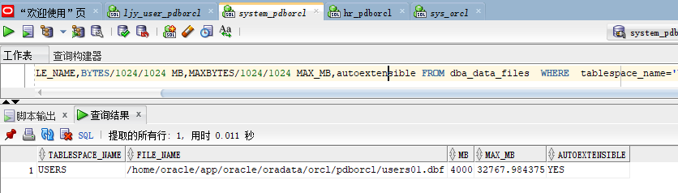
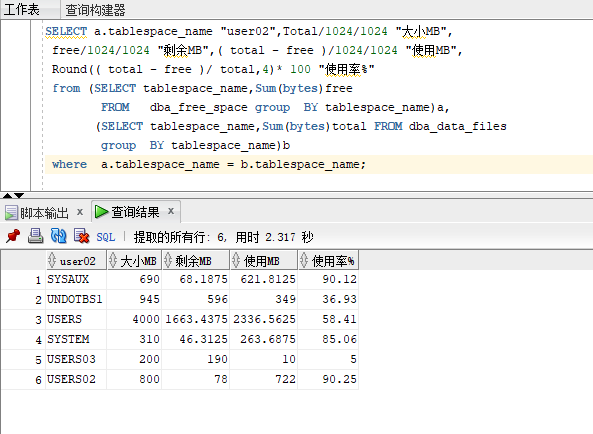
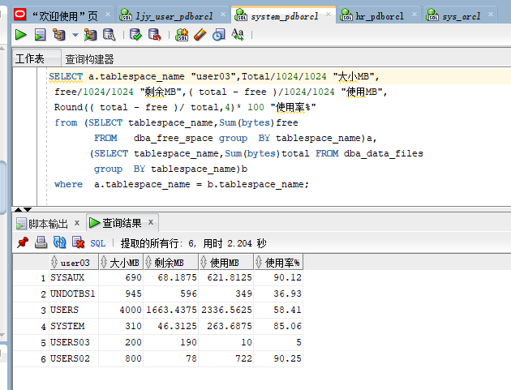

# 实验3：创建分区表

### 刘家银 软件18-3 学号：201810414313

### 实验目的

掌握分区表的创建方法，掌握各种分区方式的使用场景。

### 实验内容

- 使用3个表空间：USERS,USERS02,USERS03。在表空间中创建两张表：订单表(orders)与订单详表(order_details)。
- 使用自己的账号创建本实验的表，表创建在上述3个分区，自定义分区策略。
- 需要使用system用户给你自己的账号分配上述分区的使用权限。你需要使用system用户给你的用户分配可以查询执行计划的权限。
- 表创建成功后，插入数据，数据能并平均分布到各个分区。每个表的数据都应该大于1万行，对表进行联合查询。
- 写出插入数据的语句和查询数据的语句，并分析语句的执行计划。
- 进行分区与不分区的对比实验。

### 实验步骤

- 更改用户状态

  

- 登录ljy_user,运行test3.sql

  

- 运行结果查看

  

- 以system用户运行，简单查询和联表查询

  > 单表查询

  

  > 联表查询

  

- 查看表空间和数据库文件及其磁盘占用情况

  

  

  

### 总结体会

通过这次实验，学习了解到在，Oracle中如何对表分区，以及如何设计分区。

在Oracle数据库中，如果表的大小超过2GB，并且表中包含历史数据，新的数据背增加到新的分区中是需要用到分区表的。

当然，使用分区表的优点也是显而易见的：

- 改善查询性能：对分区对象的查询可以仅搜索自己关心的分区，提高检索速度。
- 增强可用性：如果表的某个分区出现故障，表在其他分区的数据仍然可用；
- 维护方便：如果表的某个分区出现故障，需要修复数据，只修复该分区即可；
- 均衡I/O：可以把不同的分区映射到磁盘以平衡I/O，改善整个系统性能。

除此以外也有一定不足的点：

- 已经存在的表是没有方法可以直接转化为分区表的。

