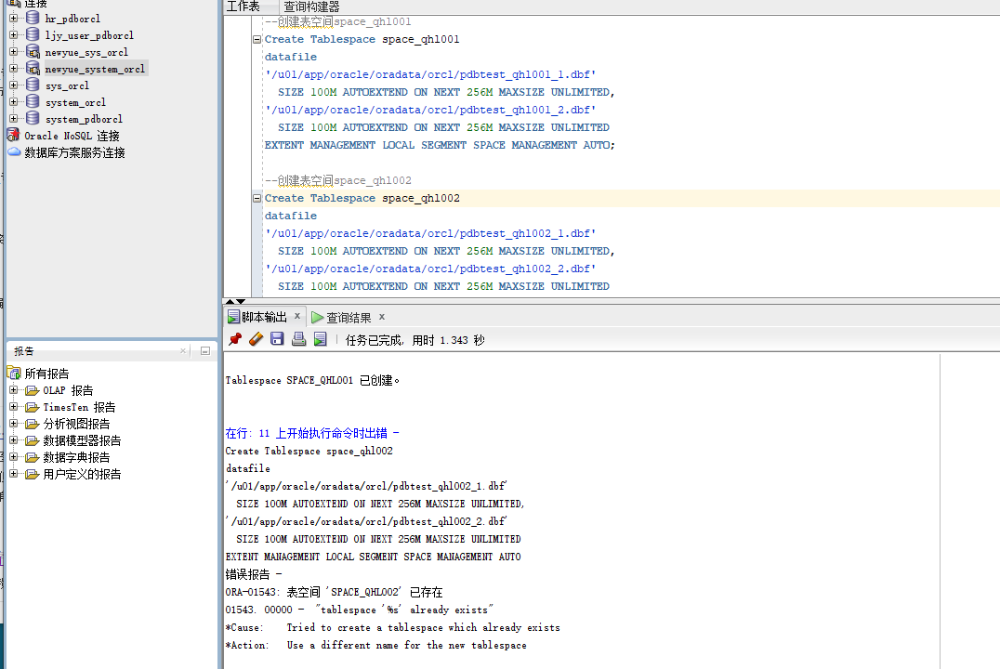
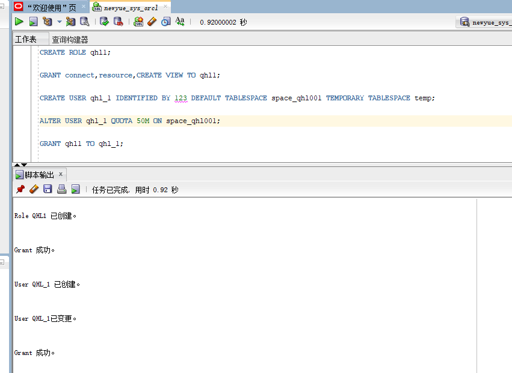
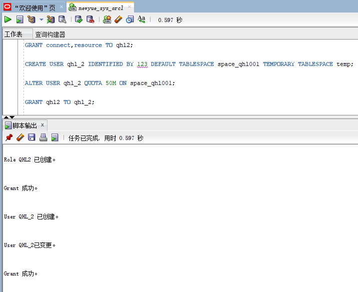
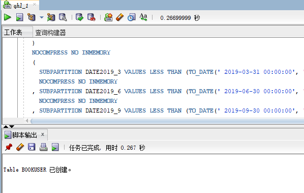
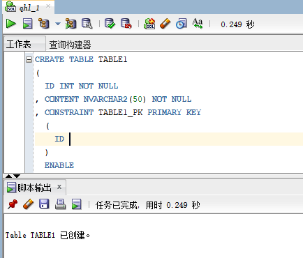
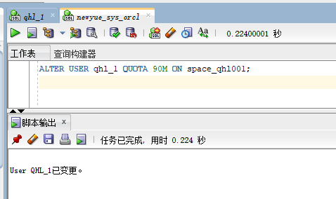
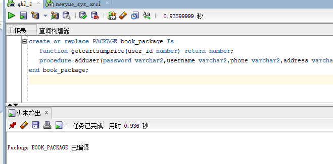
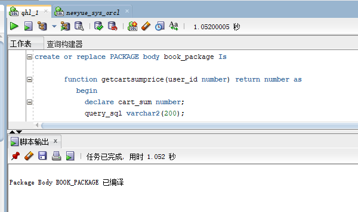
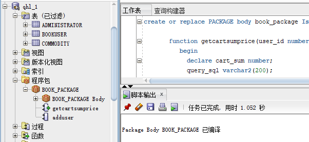
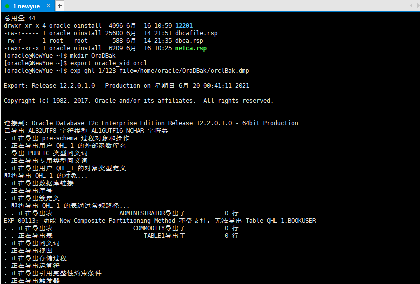

# 基于Oracle的二手书交易系统数据库设计

### 刘家银 软件18-3 学号：201810414313

## 项目背景

为了满足现如今二手书交易市场的需求，各种书籍交易系统层出不穷。但又因为数据库系统的高效性而诟病，故此，我们选择基于Oracle数据库来设计这样一个系统来满足我们行业现状。

## 项目设计过程

### 1.创建表空间space_qhl001、space_qhl002

- 代码

> ```sql
> --创建表空间space_qhl001
> Create Tablespace space_qhl001
> datafile
> '/u01/app/oracle/oradata/orcl/pdbtest_qhl001_1.dbf'
>   SIZE 100M AUTOEXTEND ON NEXT 256M MAXSIZE UNLIMITED,
> '/u01/app/oracle/oradata/orcl/pdbtest_qhl001_2.dbf'
>   SIZE 100M AUTOEXTEND ON NEXT 256M MAXSIZE UNLIMITED
> EXTENT MANAGEMENT LOCAL SEGMENT SPACE MANAGEMENT AUTO;
> 
> --创建表空间space_qhl002
> Create Tablespace space_qhl002
> datafile
> '/u01/app/oracle/oradata/orcl/pdbtest_qhl002_1.dbf'
>   SIZE 100M AUTOEXTEND ON NEXT 256M MAXSIZE UNLIMITED,
> '/u01/app/oracle/oradata/orcl/pdbtest_qhl002_2.dbf'
>   SIZE 100M AUTOEXTEND ON NEXT 256M MAXSIZE UNLIMITED
> EXTENT MANAGEMENT LOCAL SEGMENT SPACE MANAGEMENT AUTO;
> ```

- 结果:

> 

### 2.创建用户以及角色

- 创建角色qhl1将connect,resource,create view授权给qhl1
- 创建用户qhl_1
- 分配50M空间给qhl_1并将角色qhl1授权给用户qhl_1

> 代码：
>
> ```sql
> CREATE ROLE qhl1;
> 
> GRANT connect,resource,CREATE VIEW TO qhl1;
> 
> CREATE USER qhl_1 IDENTIFIED BY 123 DEFAULT TABLESPACE space_qhl001 TEMPORARY TABLESPACE temp;
> 
> ALTER USER qhl_1 QUOTA 50M ON space_qhl001;
> 
> GRANT qhl1 TO qhl_1;
> ```
>
> 截图：
>
> 

- 创建角色qhl2将connect,resource授权给qhl2
- 创建用户qhl_2
- 分配50M空间给qhl_2并将角色qhl2授权给用户qhl_2

> 代码:
>
> ```sql
> GRANT connect,resource TO qhl2;
> 
> CREATE USER qhl_2 IDENTIFIED BY 123 DEFAULT TABLESPACE space_qhl001 TEMPORARY TABLESPACE temp;
> 
> ALTER USER qhl_2 QUOTA 50M ON space_qhl001;
> 
> GRANT qhl2 TO qhl_2;
> ```
>
> 截图:
>
> 

### 3.在用户qhl_1下创建表

- 创建管理员表(id为主键)

> 代码:
>
> ```sql
> CREATE TABLE ADMINISTRATOR 
> (
>   ID NUMBER(*, 0) NOT NULL 
> , PASSWORD VARCHAR2(20 BYTE) NOT NULL 
> , ADMIN VARCHAR2(20 BYTE) NOT NULL 
> , CONSTRAINT ADMINISTRATOR_PK PRIMARY KEY 
>   (
>     ID 
>   )
>   USING INDEX 
>   (
>       CREATE UNIQUE INDEX ADMINISTRATOR_PK ON ADMINISTRATOR (ID ASC) 
>       LOGGING 
>       TABLESPACE SPACE_QHL001 
>       PCTFREE 10 
>       INITRANS 2 
>       STORAGE 
>       ( 
>         BUFFER_POOL DEFAULT 
>       ) 
>       NOPARALLEL 
>   )
>   ENABLE 
> ) 
> LOGGING 
> TABLESPACE SPACE_QHL001 
> PCTFREE 10 
> INITRANS 1 
> STORAGE 
> ( 
>   BUFFER_POOL DEFAULT 
> ) 
> NOCOMPRESS 
> NO INMEMORY 
> NOPARALLEL;
> ```
>
> 结果:
>
> 

- 创建用户表(id为主键，按注册日期范围分区，分为2018、2019两个区，每年按季度划分4个子分区)

> ```sql
> CREATE TABLE BOOKUSER 
> (
>   ID NUMBER(*, 0) NOT NULL 
> , PASSWORD VARCHAR2(20 BYTE) NOT NULL 
> , USERNAME VARCHAR2(50 BYTE) NOT NULL 
> , PHONE VARCHAR2(20 BYTE) NOT NULL 
> , ADDRESS VARCHAR2(30 BYTE) NOT NULL 
> , REGISTRATIONDATE DATE NOT NULL 
> , CART_ID NUMBER(*, 0) NOT NULL 
> , CONSTRAINT U_PK PRIMARY KEY 
>   (
>     ID 
>   )
>   USING INDEX 
>   (
>       CREATE UNIQUE INDEX U_PK ON BOOKUSER (ID ASC) 
>       LOGGING 
>       TABLESPACE SPACE_QHL001 
>       PCTFREE 10 
>       INITRANS 2 
>       STORAGE 
>       ( 
>         BUFFER_POOL DEFAULT 
>       ) 
>       NOPARALLEL 
>   )
>   ENABLE 
> ) 
> TABLESPACE SPACE_QHL001 
> PCTFREE 10 
> INITRANS 1 
> STORAGE 
> ( 
>   BUFFER_POOL DEFAULT 
> ) 
> NOCOMPRESS 
> NOPARALLEL 
> PARTITION BY RANGE (REGISTRATIONDATE) 
> SUBPARTITION BY RANGE (REGISTRATIONDATE) 
> (
>   PARTITION DATE2018 VALUES LESS THAN (TO_DATE(' 2018-12-31 00:00:00', 'SYYYY-MM-DD HH24:MI:SS', 'NLS_CALENDAR=GREGORIAN')) 
>   TABLESPACE SPACE_QHL001 
>   PCTFREE 10 
>   INITRANS 1 
>   STORAGE 
>   ( 
>     BUFFER_POOL DEFAULT 
>   ) 
>   NOCOMPRESS NO INMEMORY 
>   (
>     SUBPARTITION DATE2018_3 VALUES LESS THAN (TO_DATE(' 2018-03-31 00:00:00', 'SYYYY-MM-DD HH24:MI:SS', 'NLS_CALENDAR=GREGORIAN')) 
>     NOCOMPRESS NO INMEMORY  
>   , SUBPARTITION DATE2018_6 VALUES LESS THAN (TO_DATE(' 2018-06-30 00:00:00', 'SYYYY-MM-DD HH24:MI:SS', 'NLS_CALENDAR=GREGORIAN')) 
>     NOCOMPRESS NO INMEMORY  
>   , SUBPARTITION DATE2018_9 VALUES LESS THAN (TO_DATE(' 2018-09-30 00:00:00', 'SYYYY-MM-DD HH24:MI:SS', 'NLS_CALENDAR=GREGORIAN')) 
>     NOCOMPRESS NO INMEMORY  
>   , SUBPARTITION DATE2018_12 VALUES LESS THAN (TO_DATE(' 2018-12-31 00:00:00', 'SYYYY-MM-DD HH24:MI:SS', 'NLS_CALENDAR=GREGORIAN')) 
>     NOCOMPRESS NO INMEMORY  
>   )  
> , PARTITION DATE2019 VALUES LESS THAN (TO_DATE(' 2019-12-31 00:00:00', 'SYYYY-MM-DD HH24:MI:SS', 'NLS_CALENDAR=GREGORIAN')) 
>   TABLESPACE SPACE_QHL001 
>   PCTFREE 10 
>   INITRANS 1 
>   STORAGE 
>   ( 
>     BUFFER_POOL DEFAULT 
>   ) 
>   NOCOMPRESS NO INMEMORY 
>   (
>     SUBPARTITION DATE2019_3 VALUES LESS THAN (TO_DATE(' 2019-03-31 00:00:00', 'SYYYY-MM-DD HH24:MI:SS', 'NLS_CALENDAR=GREGORIAN')) 
>     NOCOMPRESS NO INMEMORY  
>   , SUBPARTITION DATE2019_6 VALUES LESS THAN (TO_DATE(' 2019-06-30 00:00:00', 'SYYYY-MM-DD HH24:MI:SS', 'NLS_CALENDAR=GREGORIAN')) 
>     NOCOMPRESS NO INMEMORY  
>   , SUBPARTITION DATE2019_9 VALUES LESS THAN (TO_DATE(' 2019-09-30 00:00:00', 'SYYYY-MM-DD HH24:MI:SS', 'NLS_CALENDAR=GREGORIAN')) 
>     NOCOMPRESS NO INMEMORY  
>   , SUBPARTITION DATE2019_12 VALUES LESS THAN (TO_DATE(' 2019-12-31 00:00:00', 'SYYYY-MM-DD HH24:MI:SS', 'NLS_CALENDAR=GREGORIAN')) 
>     NOCOMPRESS NO INMEMORY  
>   )  
> );
> ```

结果：



- 创建商品表

  ```sql
  CREATE TABLE COMMODITY 
  (
    ID NUMBER(*, 0) NOT NULL 
  , PID NUMBER(*, 0) NOT NULL 
  , BOOKSNAME VARCHAR2(20 BYTE) NOT NULL 
  , PRICE NUMBER NOT NULL 
  , DESCRIBE VARCHAR2(50 BYTE) NOT NULL 
  , NUM NUMBER(*, 0) NOT NULL 
  , ADMIN_ID NUMBER(*, 0) NOT NULL 
  , CONSTRAINT COMMODITY_PK PRIMARY KEY 
    (
      ID 
    )
    USING INDEX 
    (
        CREATE UNIQUE INDEX COMMODITY_PK ON COMMODITY (ID ASC) 
        LOGGING 
        TABLESPACE SPACE_QHL001 
        PCTFREE 10 
        INITRANS 2 
        STORAGE 
        ( 
          BUFFER_POOL DEFAULT 
        ) 
        NOPARALLEL 
    )
    ENABLE 
  ) 
  LOGGING 
  TABLESPACE SPACE_QHL001 
  PCTFREE 10 
  INITRANS 1 
  STORAGE 
  ( 
    BUFFER_POOL DEFAULT 
  ) 
  NOCOMPRESS 
  NO INMEMORY 
  NOPARALLEL;
  ```

  

- 创建购物车表

  > - 用户表字段BOOKUSER_ID为购物车表的外键
  > - 购物车采用引用分区

  ```sql
  CREATE TABLE CART 
  (
    ID NUMBER(*, 0) NOT NULL 
  , AMOUNT NUMBER(*, 0) NOT NULL 
  , PID NUMBER(*, 0) NOT NULL 
  , BOOKUSER_ID NUMBER(*, 0) NOT NULL 
  , CONSTRAINT CART_PK PRIMARY KEY 
    (
      ID 
    )
    USING INDEX 
    (
        CREATE UNIQUE INDEX CART_PK ON CART (ID ASC) 
        LOGGING 
        TABLESPACE SPACE_QHL001 
        PCTFREE 10 
        INITRANS 2 
        STORAGE 
        ( 
          BUFFER_POOL DEFAULT 
        ) 
        NOPARALLEL 
    )
    ENABLE 
  , CONSTRAINT CART_BOOKUSER FOREIGN KEY
    (
    BOOKUSER_ID 
    )
    REFERENCES BOOKUSER
    (
    CART_ID 
    )
    ENABLE 
  ) 
  PCTFREE 10 
  PCTUSED 40 
  INITRANS 1 
  STORAGE 
  ( 
    BUFFER_POOL DEFAULT 
  ) 
  NOCOMPRESS 
  NOPARALLEL 
  PARTITION BY REFERENCE (CART_BOOKUSER) 
  (
    PARTITION DATE2018_3 
    LOGGING 
    TABLESPACE SPACE_QHL001 
    PCTFREE 10 
    INITRANS 1 
    STORAGE 
    ( 
      BUFFER_POOL DEFAULT 
    ) 
    NOCOMPRESS NO INMEMORY  
  , PARTITION DATE2018_6 
    LOGGING 
    TABLESPACE SPACE_QHL001 
    PCTFREE 10 
    INITRANS 1 
    STORAGE 
    ( 
      BUFFER_POOL DEFAULT 
    ) 
    NOCOMPRESS NO INMEMORY  
  , PARTITION DATE2018_9 
    LOGGING 
    TABLESPACE SPACE_QHL001 
    PCTFREE 10 
    INITRANS 1 
    STORAGE 
    ( 
      BUFFER_POOL DEFAULT 
    ) 
    NOCOMPRESS NO INMEMORY  
  , PARTITION DATE2018_12 
    LOGGING 
    TABLESPACE SPACE_QHL001 
    PCTFREE 10 
    INITRANS 1 
    STORAGE 
    ( 
      BUFFER_POOL DEFAULT 
    ) 
    NOCOMPRESS NO INMEMORY  
  , PARTITION DATE2019_3 
    LOGGING 
    TABLESPACE SPACE_QHL001 
    PCTFREE 10 
    INITRANS 1 
    STORAGE 
    ( 
      BUFFER_POOL DEFAULT 
    ) 
    NOCOMPRESS NO INMEMORY  
  , PARTITION DATE2019_6 
    LOGGING 
    TABLESPACE SPACE_QHL001 
    PCTFREE 10 
    INITRANS 1 
    STORAGE 
    ( 
      BUFFER_POOL DEFAULT 
    ) 
    NOCOMPRESS NO INMEMORY  
  , PARTITION DATE2019_9 
    LOGGING 
    TABLESPACE SPACE_QHL001 
    PCTFREE 10 
    INITRANS 1 
    STORAGE 
    ( 
      BUFFER_POOL DEFAULT 
    ) 
    NOCOMPRESS NO INMEMORY  
  , PARTITION DATE2019_12 
    LOGGING 
    TABLESPACE SPACE_QHL001 
    PCTFREE 10 
    INITRANS 1 
    STORAGE 
    ( 
      BUFFER_POOL DEFAULT 
    ) 
    NOCOMPRESS NO INMEMORY  
  );
  ```

- 创建论坛表

  ```sql
  CREATE TABLE TABLE1 
  (
    ID INT NOT NULL 
  , CONTENT NVARCHAR2(50) NOT NULL 
  , CONSTRAINT TABLE1_PK PRIMARY KEY 
    (
      ID 
    )
    ENABLE 
  );
  ```

  

- 用户qhl_1的空间不足，修改qhl_1空间大小

  ```sql
  ALTER USER qhl_1 QUOTA 90M ON space_qhl001;
  ```

  

### 4.插入用户、商品、购物车数据

- 代码

  ```sql
  declare
    id number(38,0);
    username varchar2(50);
    phone varchar2(20);
    address varchar2(30);
    REGISTRATIONDATE date;
    booksname varchar2(50);
    price number(5,2);
    num number(38,0);
    amount number(38,0);
    
  begin
    for i in 1..20000
    loop
      if i mod 2 =0 then
        REGISTRATIONDATE:=to_date('2018-5-6','yyyy-mm-dd')+(i mod 60);
      else
        REGISTRATIONDATE:=to_date('2019-5-6','yyyy-mm-dd')+(i mod 60);
      end if;
  
      --插入用户
      id:=SEQ_ORDER_ID.nextval; --应该将SEQ_ORDER_ID.nextval保存到变量中。
      username := 'aa'|| 'aa';
      username := 'wang' || i;
      phone := '131785693' || i;
  	booksname := '唐诗三百首版本号' || i;
  	address :='成都'|| '四川';
  	price :=(dbms_random.value() * 100);
  	num :=(i mod 5);
      insert /*+append*/ into bookuser (id,password,username,phone,address,REGISTRATIONDATE,cart_id)
        values (id,username,username,phone,address,REGISTRATIONDATE,id);
  	--插入货品
  		
  	insert into commodity(id,pid,booksname,price,describe,num,admin_id)
  		values (id,id,booksname,price,'good',num,1);
  	--插入购物车
  	amount :=(id mod 3 ) + 1;
  	insert into cart(id,amount,pid,bookuser_id)
  	 	values (id,amount,id,id);
  
      IF I MOD 1000 =0 THEN
        commit; --每次提交会加快插入数据的速度
      END IF;
    end loop;
   
  end;
  ```


### 5.创建程序包、存储过程、函数执行分析计划

- 创建程序包

  > 函数getcartsumprice计算每个用户的购物车商品总金额
  >
  > 存储过程adduser插入用户信息

  ```sql
  create or replace PACKAGE book_package Is
     function getcartsumprice(user_id number) return number;
     procedure adduser(password varchar2,username varchar2,phone varchar2,address varchar2,registerdate VARCHAR2);
  end book_package;
  ```

  

- 创建函数、存储过程

  ```sql
  create or replace PACKAGE body book_package Is
   
         function getcartsumprice(user_id number) return number as
            begin
              declare cart_sum number;
  			query_sql varchar2(200);
              begin
  			query_sql:='select sum(pricesum) from view_SinglePriceSum where ID=' || user_id;
                execute immediate query_sql into cart_sum;
  			  return cart_sum;
              end;
          end getcartsumprice;
                    procedure addUser(password varchar2,username varchar2,phone varchar2,address varchar2,registerdate varchar2) as
              begin
                declare maxId number;
                begin
                  select max(id) into maxId from bookuser;
                  insert into bookuser values(maxId+1,password,username,phone,address,to_date(registerdate,'yyyy-mm-dd'),maxId+1);
                  commit;
                end;
              end adduser;
      end book_package;
  ```

  

  

- 使用存储过程adduser插入用户数据

  ```sql
  set serveroutput on
  declare
  begin
  BOOK_PACKAGE.addUser('1223','cdu','125666','hongkong','2019-05-02');
  end;
  ```

  

- 执行计划分析

  ```sql
  select * from BOOKUSER b,COMMODITY co,CART ca where b.id=ca.BOOKUSER_ID and ca.PID=co.PID and
  b.REGISTRATIONDATE between to_date('2018-1-1','yyyy-mm-dd') and to_date('2018-6-1','yyyy-mm-dd');
  ```

- 表空间使用情况

  ```sql
  SELECT a.tablespace_name "表空间名",
  total "表空间大小",
  free "表空间剩余大小",
  (total - free) "表空间使用大小",
  total / (1024 * 1024 * 1024) "表空间大小(G)",
  free / (1024 * 1024 * 1024) "表空间剩余大小(G)",
  (total - free) / (1024 * 1024 * 1024) "表空间使用大小(G)",
  round((total - free) / total, 4) * 100 "使用率 %"
  FROM (SELECT tablespace_name, SUM(bytes) free
  FROM dba_free_space
  GROUP BY tablespace_name) a,
  (SELECT tablespace_name, SUM(bytes) total
  FROM dba_data_files
  GROUP BY tablespace_name) b
  WHERE a.tablespace_name = b.tablespace_name
  ```

### 6.手动备份



### 7.容灾方案设计


## 总结

此次项目设计基本涵盖Oracle数据库的常用技术，尽管并没有做到每一步都很完美，尤其是最后的容灾设计方案由于条件和时间等因素影响并没有去实现，但其它的设计过程对自己也是一个挑战。完成此次的课程设计对于个人学习Oracle数据库有着很大的帮助，加深了我对Oracle数据库的理解和认识。